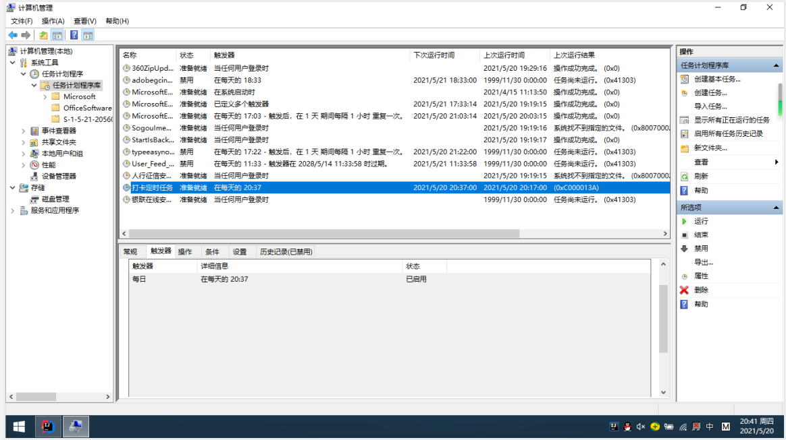
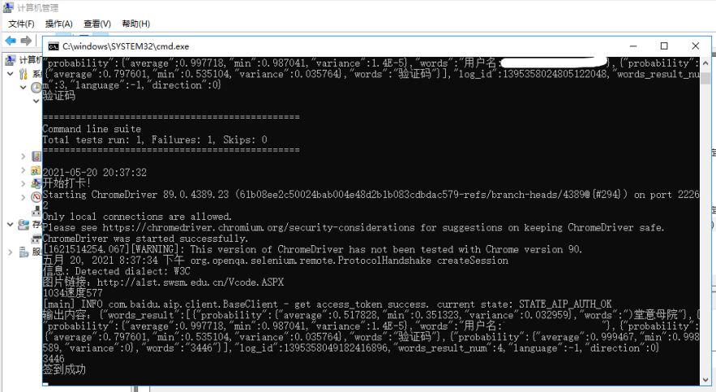

# 定时打卡程序
技术栈：java、JSON、多线程、图片转码、selenium、TestNg、谷歌浏览器驱动、百度图像识别

## 准备工作(已完成，直接运行)
一、将selenium-java-3.141.59.zip中所有包导入项目 (已导入项目中)

二、将chromedriver.exe放到某路径下

三、配置TestNG，将org.testng.eclipse.updatesite.zip中两个文件夹解压到eclipse的安装路径下的“dropins”，然后重启eclipse，检查是否安装成功（new-》other-》TestNG）。

四、TestNG的testng-6.14.3.jar和jcommander-1.71.jar导入项目

五、导入百度图像识别相关jar包

## 运行
1、在NewTest中，输入账号，密码。

2、将浏览器驱动放到相应位置(记住路径)，在NewTest中，修改浏览器驱动。

3、去百度图像识别创建一个实例，把相关参数，输入到NewTest中的调用接口中(已创立，也可自行创立，修改baidusample)。

5、直接右键ThreadPool(多线程)或者Pool(普通调用)，选择启动Run

6、打包成jar、部署服务器-使用多线程设置ThreadPool为执行入口，部署本机-使用普通函数设置Pool为执行入口

7、可以部署到网络服务器上执行。 还可以自创bat文件(写入运行jar命令)可执行脚本，部署到自己的电脑里定时执行(Windows自带定时，可不用多线程)。

8、部署windows本机，修改qdTest.bat文件中的路径(改成你的文件路径)，然后打开按照参考文档部署。
* 设置自动开机：https://www.yunqishi.net/video/38836.html
* 设置电脑睡眠时间：选择电源和睡眠
* 设置自动连接网络WiFi：点击WiFi属性
``

参考链接：
* 部署参考：https://www.jianshu.com/p/e7e13a11bf9c
* idea导出jar包：https://www.cnblogs.com/ffaiss/p/10908483.html
* 部署到本机windows参考：https://blog.csdn.net/projectNo/article/details/81773744
* 把本地idea上的项目上传到github上:https://www.cnblogs.com/gougouyangzi/articles/9429280.html
* github第一次新建：create git repository -> add -> commit -> share project on github
* github第二次修改：add -> commit push

项目地址：https://github.com/15123394002/qdTest
